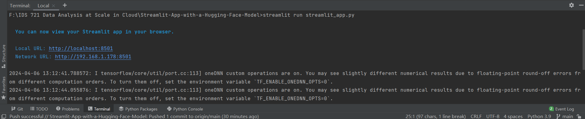
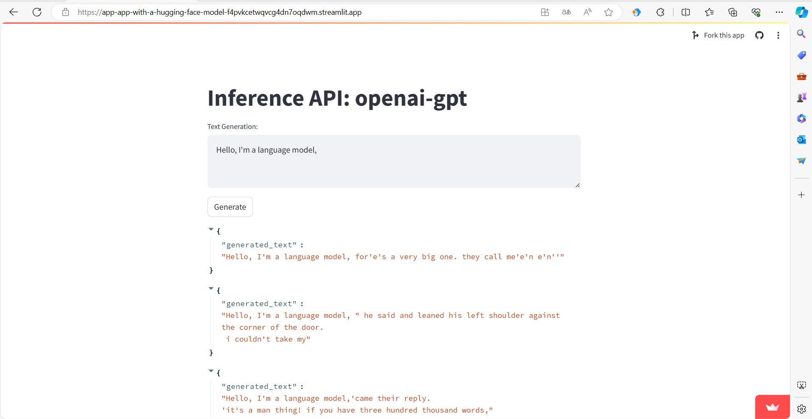

# Streamlit App with a Hugging Face Model
This application demonstrates a simple web interface for generating text using the OpenAI GPT model. Built with Streamlit, it allows users to input a text prompt and generates continuations of the text based on the input.

## Project Setup
### Install necessary packages
Run the follow command to install the packages:
```bash
pip install -r requirements.txt
```
### Implement Streamlit Web Application
The detailed implementation is in `streamlit_app.py`, which can be accessed [here](./streamlit_app.py).



### Test Locally
Run the following command to test the application locally.
```bash
streamlit run streamlit_app.py
```

## Project Deployment

1. Create an account and signin to https://streamlit.io/.
2. Under https://share.streamlit.io/, create a new app **using existing repo**.
3. Make sure the repo, branch, and application file are correct.
4. Then deploy. You can access the logs while the app is being deployed.
5. After the deployment is successful, the Streamlit application can be accessed using the URL.
## Deployment URL
>https://app-app-with-a-hugging-face-model-f4pvkcetwqvcg4dn7oqdwm.streamlit.app/

